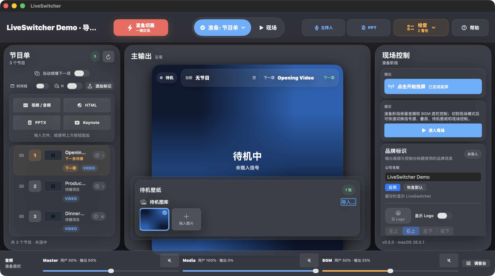

<div align="center">

# LiveSwitcher

**A native macOS live-event switching console for small stages, meetups, presentations, and event rooms.**

[](https://github.com/91wan/LiveSwitcher/releases)


English | [中文](README_ZH.md) | [Install](#install) | [FAQ](#faq)

</div>

---

## Screenshots



_Current v0.5.0 console shown with demo data._

## What It Does

LiveSwitcher combines the tools usually spread across a playlist, a presentation app, a music player, and a display switcher into one focused macOS app.

- Build a program queue from video, audio, Keynote, PPTX, and local HTML files.
- Switch content to an external display with wallpaper fallback.
- Keep background music ready with master, media, and BGM volume control.
- Use emergency blackout for stage-safe cut-to-black and mute.
- Add practical overlays: lower third, countdown, and scrolling ticker.
- Use PPT/page-clicker interception when presentation control needs to stay routed to the show app.

## Install

Download the latest release zip from [Releases](https://github.com/91wan/LiveSwitcher/releases), unzip it, and move `LiveSwitcher.app` to `/Applications`.

Current release asset:

```text
LiveSwitcher-macOS-v0.5.0.zip
LiveSwitcher-macOS-v0.5.0.zip.sha256
```

Verify the checksum before opening the app:

```bash
shasum -a 256 -c LiveSwitcher-macOS-v0.5.0.zip.sha256
```

Important: the public build is source-available, ad-hoc signed, and **not notarized**. On first launch, macOS Gatekeeper may block it. Open **System Settings -> Privacy & Security -> Open Anyway**, or build from source locally. A notarized build will require Apple Developer ID signing credentials and notarytool secrets.

## Permissions

LiveSwitcher can run without special permissions for basic playlist and monitor work. Some workflows need macOS permissions:

| Permission | Why it is needed |
| --- | --- |
| Accessibility | Required for PPT/page-clicker interception. |
| Apple Events | Required when controlling Keynote or compatible presentation apps. |
| Microphone | Reserved for audio-monitoring workflows. |

## What's New in v0.5.0

- More reliable Media and BGM switching: stale player callbacks can no longer overwrite the active program or track.
- Safer BGM library editing: removing or reordering tracks updates live playback state immediately without ghost tracks.
- Stronger Panic, projection, and PPT lifecycle handling for delayed audio pauses, display loss, and EventTap state.
- Program queue, selection, activation, persistence, and audio routing now keep one authoritative live state.
- Preflight, Safety Cockpit, and sanitized Support Reports provide a clearer release and incident workflow.
- A canonical Release Candidate rehearsal gate now covers hardware, permissions, privacy, and long-running playback.

See [`docs/qa/release-hygiene-v0.5.0.md`](docs/qa/release-hygiene-v0.5.0.md) for the v0.5.0 release notes and trust gates.

中文维护说明：`v0.5.0` 的重点不是新增现场功能，而是冻结当前 runtime ownership 架构，并把发布流程收紧到可复验的候选包和 Draft Release。

## Live Preflight

Open the `?` button, switch from `Help` to `Preflight`, and review the live state before projection. The panel reads current runtime state, including external display availability, projection state, current program, BGM readiness/takeover, speaker mode, panic blackout, PPT mode, overlays, wallpaper fallback, auto-next video, and effective media/BGM volume.

Use `Needs attention` before a show. It filters the live checklist to only failed and warning rows, while `All checks` remains available for a full audit. `Copy Report` always copies the complete report, not the filtered view.

For a larger operator view, click `Open Cockpit` or use the macOS `现场控制 -> 打开现场安全台` command. The Safety Cockpit keeps the main console unchanged while showing readiness, top risks, safe actions, sanitized recent events, and support export controls in a separate window.

Use `Copy Support` or `Save Support...` when reporting a bug. Support reports are text-only and sanitized: they include runtime diagnostics, full preflight, and recent event kinds, but not local file paths, raw media filenames, file URLs, screenshots, system logs, overlay text, or customer content.

Related guides:

- [Release Candidate rehearsal](docs/qa/release-candidate-rehearsal.md)
- [v0.5.0 release acceptance](docs/qa/release-acceptance-v0.5.0.md)
- [v0.5.0 release hygiene](docs/qa/release-hygiene-v0.5.0.md)
- [v0.5.0 workspace guard](docs/qa/workspace-guard-v0.5.0.md)
- [Current UI verification](docs/qa/ui-current-main.md)
- [Runtime ownership](docs/architecture/runtime-ownership.md)
- [Live Mode simplicity rules](docs/architecture/live-mode-simplicity-rules.md)

Older version-specific QA notes remain historical references and are not the current release gate.

## v0.2 Live Safety Baseline

- Projection fails closed when no external display is available, and stops projection if the external display is disconnected.
- Speaker mode ducks both media/video audio and BGM to keep live speech clear.
- Playing BGM temporarily fades media audio down and fades BGM in without changing the saved audio strategy.
- The wallpaper tray accepts real Finder image drops and filters non-image files.
- Video can optionally auto-advance only to the immediately next video item; it never auto-opens HTML, PPTX, or Keynote.
- Speaker mode, panic blackout, and PPT mode are available from the macOS menu with keyboard shortcuts.

## Build, Test, Run

```bash
git clone https://github.com/91wan/LiveSwitcher.git
cd LiveSwitcher

swift build
swift test
./script/build_and_run.sh --verify
```

Daily shortcuts:

```bash
make build
make run
make test
make guard-dev
make release-check
bash Sources/AnnualMeetingSwitcher/build_v33.sh
./script/check_release_hygiene.sh
```

`./script/build_and_run.sh --verify` builds `dist/LiveSwitcher.app`, launches it, and verifies that the app process remains running.

`make guard-dev` fails on any dirty workspace before local validation. `make release-check` is the pre-tag maintainer gate and requires `main` to match `origin/main`.

## UI Verification

This repository keeps real UI verification screenshots under:

```text
docs/assets/ui-matrix/2026-05-03/
docs/assets/ui-matrix/2026-05-04/
docs/assets/ui-matrix/2026-05-04-v021/
```

The matrix covers three window sizes (`1360x760`, `1440x800`, maximized). Older screenshots are kept as regression artifacts; the current information architecture is Run Desk, Live Ops, Audio / BGM Library, and Overlays / Overlay Composer.

## Repository Shape

```text
.
├── Package.swift
├── Makefile
├── README.md
├── README_ZH.md
├── docs/assets/
├── script/
├── Sources/AnnualMeetingSwitcher/
└── .github/workflows/
```

## FAQ

### Is LiveSwitcher notarized?

No. The public release is ad-hoc signed but not notarized. Expect Gatekeeper to require manual approval on first launch.

### Does it support Windows or Linux?

No. LiveSwitcher is a native macOS SwiftUI app.

### Can I use it without a second display?

Yes. You can prepare playlists, music, wallpapers, and overlays on a single Mac. External display output is only required for live projection workflows.

### Why are Keynote/PPT permissions required?

Presentation control relies on macOS automation and accessibility APIs. macOS requires explicit user permission for those actions.

## No License

No open-source license is provided. This repository is source-available for review and local building, but all rights are reserved by the repository owner unless a license is added later.
