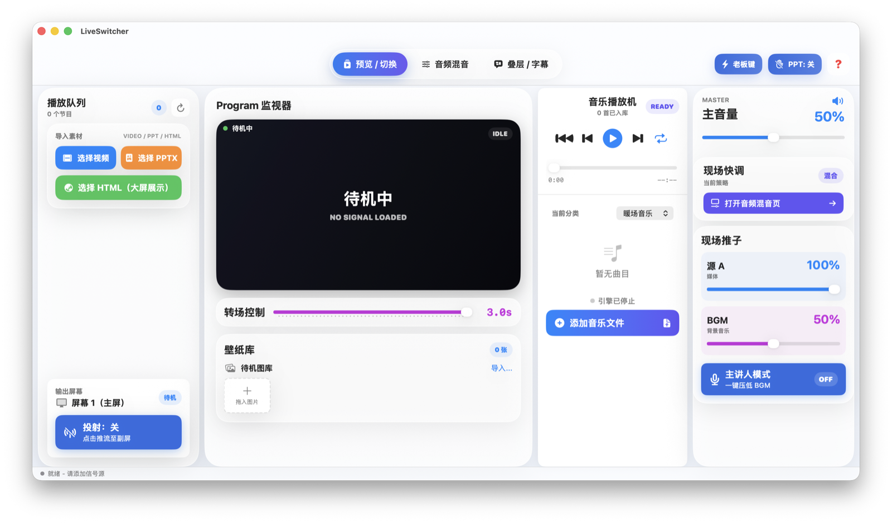
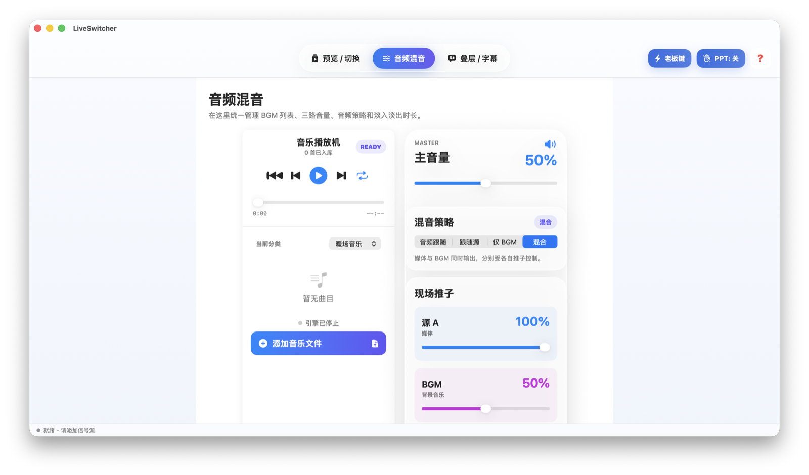
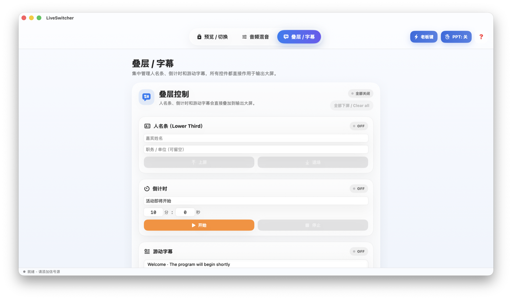

<div align="center">

# LiveSwitcher

**A native macOS live-event switching console for small stages, meetups, presentations, and event rooms.**

**面向小型舞台、会议、演示和活动空间的原生 macOS 现场播控切换台。**

[](https://github.com/91wan/LiveSwitcher/releases)


English | [中文](#中文说明) | [Install](#install--安装) | [FAQ](#faq--常见问题)

</div>

---

## Screenshots

| Preview / Switching | Audio Mixer | Overlays / Subtitles |
| --- | --- | --- |
|  |  |  |

## What It Does

LiveSwitcher combines the tools usually spread across a playlist, a presentation app, a music player, and a display switcher into one focused macOS app.

- Build a program queue from video, audio, Keynote, PPTX, and local HTML files.
- Switch content to an external display with wallpaper fallback.
- Keep background music ready with master, media, and BGM volume control.
- Use emergency blackout for stage-safe cut-to-black and mute.
- Add practical overlays: lower third, countdown, and scrolling ticker.
- Use PPT/page-clicker interception when presentation control needs to stay routed to the show app.

## 中文说明

LiveSwitcher 把现场常用的节目列表、演示软件、音乐播放器和外接屏切换能力收在一个 macOS App 里，目标是让小型活动现场更稳、更直观。

- 支持把视频、音频、Keynote、PPTX 和本地 HTML 加入节目队列。
- 支持切换到外接屏，并在无节目时回退到待机壁纸。
- 支持背景音乐、主音量、媒体音量和 BGM 音量控制。
- 支持老板键：一键切黑副屏并静音。
- 支持实用叠层：人名条、倒计时、游动字幕。
- 支持 PPT/翻页笔拦截，让演示控制更贴近现场流程。

## Install / 安装

Download the latest release zip from [Releases](https://github.com/91wan/LiveSwitcher/releases), unzip it, and move `LiveSwitcher.app` to `/Applications`.

从 [Releases](https://github.com/91wan/LiveSwitcher/releases) 下载最新 zip，解压后把 `LiveSwitcher.app` 拖到 `/Applications`。

Current release asset:

当前发布资产：

```text
LiveSwitcher-macOS-v0.2.3.zip
```

Important: the public build is ad-hoc signed and **not notarized**. On first launch, macOS Gatekeeper may block it. Open **System Settings -> Privacy & Security -> Open Anyway**, or build from source locally.

注意：当前公开构建使用 ad-hoc 签名，**未经过 Apple notarization**。首次启动时 macOS Gatekeeper 可能会拦截。可以到 **系统设置 -> 隐私与安全性 -> 仍要打开** 放行，或从源码本地构建。

## Permissions / 权限

LiveSwitcher can run without special permissions for basic playlist and monitor work. Some workflows need macOS permissions:

LiveSwitcher 的基础播放列表和监看流程不需要特殊权限。部分现场流程需要 macOS 权限：

| Permission | Why it is needed |
| --- | --- |
| Accessibility | Required for PPT/page-clicker interception. |
| Apple Events | Required when controlling Keynote or compatible presentation apps. |
| Microphone | Reserved for audio-monitoring workflows. |

| 权限 | 用途 |
| --- | --- |
| 辅助功能 | PPT/翻页笔拦截需要此权限。 |
| Apple Events | 控制 Keynote 或兼容演示软件时需要。 |
| 麦克风 | 为音频监听类流程保留。 |

## What's New in v0.2.3 / v0.2.3 更新

- Preflight Actions: the `? -> Preflight` panel now recommends one safe action per actionable warning.
- Safe one-click fixes: operators can clear active overlays or turn off panic blackout directly from Preflight.
- Guided navigation: non-mutating actions open the relevant existing page: preview, audio mixer, or overlays.
- Hardware honesty remains strict: external-display checks stay disabled/manual and never fake-pass.

- 现场检查操作：`? -> Preflight` 面板现在会为可处理的警告给出一个安全建议操作。
- 安全一键修复：现场人员可直接从 Preflight 清空叠层或关闭老板键黑屏。
- 引导跳转：非修改类操作只跳转到现有页面：预览、音频混音或叠层。
- 硬件诚实保持严格：外接屏检查仍为禁用/人工项，不会假通过。

## Preflight Actions / 现场检查操作

Preflight actions follow a **Safe One-Click** rule. Only reversible safety fixes mutate state: `Clear overlays` clears countdown, ticker, and lower third; `Turn off panic` disables an active panic blackout. Hardware-required checks are disabled and must be handled manually.

现场检查操作遵循 **Safe One-Click / 安全一键** 规则。只有可逆的安全修复会直接改状态：`Clear overlays` 会清空倒计时、游动字幕和人名条；`Turn off panic` 会关闭已激活的老板键黑屏。需要硬件的检查项保持禁用，必须人工处理。

Navigation actions such as `Open preview` and `Open audio mixer` only switch to existing tabs and close the popover. They do not change playlists, audio strategy, external-display state, wallpaper library, or playback behavior.

`Open preview`、`Open audio mixer` 等跳转类操作只切到已有页面并关闭弹窗，不会修改节目列表、音频策略、外接屏状态、壁纸库或播放行为。

See [`docs/qa/live-preflight-actions-v0.2.3.md`](docs/qa/live-preflight-actions-v0.2.3.md) for the operator workflow and safety limits.

操作流程和安全边界见 [`docs/qa/live-preflight-actions-v0.2.3.md`](docs/qa/live-preflight-actions-v0.2.3.md)。

## What's New in v0.2.2 / v0.2.2 更新

- Live Preflight: the `?` popover now includes a runtime readiness panel for display, audio, playback, overlays, and live controls.
- Copy Report: operators can copy a plain-text preflight report for handoff, incident review, support, or GitHub issue/debug notes.
- Hardware honesty: no external display is shown as not ready; hardware checks never fake-pass.

- 现场检查：`?` 弹窗新增运行态检查面板，覆盖显示、音频、播放、叠层和现场控制状态。
- 复制报告：现场人员可以复制纯文本检查报告，用于复盘、支持沟通或 GitHub issue/debug 记录。
- 硬件诚实：未检测到外接屏时明确显示未就绪，硬件检查不会假通过。

## Live Preflight / 现场检查

Open the `?` button, switch from `Help` to `Preflight`, and review the live state before projection. The panel reads current runtime state, including external display availability, projection state, current program, BGM readiness/takeover, speaker mode, panic blackout, PPT mode, overlays, wallpaper fallback, auto-next video, and effective media/BGM volume.

点击顶部 `?` 按钮，从 `Help` 切到 `Preflight`，即可在投射前检查当前运行状态。面板读取真实状态，包括外接屏、投射、当前节目、BGM 准备/BGM 接管、主讲人模式、老板键、PPT 模式、叠层、壁纸回退、自动下一条视频，以及媒体/BGM 实际输出音量。

Use `Copy Report` to copy a plain-text report. It is intended for operator handoff, incident review, support, or GitHub issue/debug notes. It is not a replacement for hardware unplug testing. External-display unplug validation still belongs to the manual checklist in [`docs/qa/live-regression-v0.2.1.md`](docs/qa/live-regression-v0.2.1.md).

使用 `Copy Report` 可复制纯文本检查报告。它适合现场交接、故障复盘、issue/debug 记录；但不能替代硬件拔线复测。外接屏断开测试仍以 [`docs/qa/live-regression-v0.2.1.md`](docs/qa/live-regression-v0.2.1.md) 的人工清单为准。

## What's New in v0.2.1 / v0.2.1 更新

- Public hygiene: README and UI matrix screenshots now use neutral demo data only.
- Regression QA: a live-event checklist covers projection, external-display loss, speaker mode, BGM takeover, wallpaper drops, auto-next video, and shortcuts.
- Copy alignment: speaker mode documentation now consistently says it ducks both media/video audio and BGM.

- 公开素材卫生：README 和 UI 矩阵截图统一使用中性演示数据。
- 现场回归：新增覆盖投射、副屏断开、主讲人、BGM 接管、壁纸拖入、自动下一条视频和快捷键的复测清单。
- 文案对齐：主讲人模式说明统一为同时压低媒体/视频声道和 BGM。

## v0.2 Live Safety Baseline / v0.2 现场安全基线

- Live safety: projection now fails closed when no external display is available, and stops projection if the external display is disconnected.
- Speaker mode: one action ducks both media/video audio and BGM to keep live speech clear.
- BGM takeover: playing BGM temporarily fades media audio down and fades BGM in without changing the saved audio strategy.
- Wallpaper import: the wallpaper tray accepts real Finder image drops and filters non-image files.
- Playback option: video can optionally auto-advance only to the immediately next video item; it never auto-opens HTML, PPTX, or Keynote.
- Desktop controls: speaker mode, panic blackout, and PPT mode are available from the macOS menu with keyboard shortcuts.

- 现场安全：无外接屏时不会投射，外接屏断开时立即停止投射，避免主屏被黑屏窗口覆盖。
- 主讲人模式：一键同时压低媒体/视频声道和 BGM，让现场人声更突出。
- BGM 接管：播放 BGM 时临时淡出媒体声、淡入 BGM，不改变用户保存的混音策略。
- 壁纸导入：“拖入图片”支持 Finder 图片拖入，并拒绝非图片文件。
- 播放选项：可选择视频播毕后只自动播放紧邻的下一条视频，不自动打开 HTML、PPTX 或 Keynote。
- 桌面控制：主讲人模式、老板键、PPT 模式加入 macOS 菜单和快捷键。

## Build, Test, Run / 构建、测试、运行

```bash
git clone https://github.com/91wan/LiveSwitcher.git
cd LiveSwitcher

swift build
swift test
./script/build_and_run.sh --verify
```

Daily shortcuts / 日常命令：

```bash
make build
make run
make test
bash Sources/AnnualMeetingSwitcher/build_v33.sh
```

`./script/build_and_run.sh --verify` builds `dist/LiveSwitcher.app`, launches it, and verifies that the app process remains running.

`./script/build_and_run.sh --verify` 会构建 `dist/LiveSwitcher.app`，启动应用，并确认应用进程能够持续运行。

## UI Verification / UI 验证

This repository keeps real UI verification screenshots under:

本仓库保留真实 UI 复测截图：

```text
docs/assets/ui-matrix/2026-05-03/
docs/assets/ui-matrix/2026-05-04/
docs/assets/ui-matrix/2026-05-04-v021/
```

The matrix covers three window sizes (`1360x760`, `1440x800`, maximized) across three tabs: preview/switching, audio mixer, and overlays/subtitles.

矩阵覆盖三个窗口尺寸（`1360x760`、`1440x800`、最大化）和三个页面：预览/切换、音频混音、叠层/字幕。

## Repository Shape / 仓库结构

```text
.
├── Package.swift
├── Makefile
├── README.md
├── docs/assets/
├── script/build_and_run.sh
├── Sources/AnnualMeetingSwitcher/
│   ├── Package.swift
│   ├── build_v33.sh
│   ├── LiveSwitcher.entitlements
│   └── Sources/AnnualMeetingSwitcher/
└── .github/workflows/
    ├── smoke-tests.yml
    └── release.yml
```

## FAQ / 常见问题

### Is LiveSwitcher notarized?

No. The public release is ad-hoc signed but not notarized. Expect Gatekeeper to require manual approval on first launch.

没有。当前公开发布版是 ad-hoc 签名，但未 notarized。首次启动时通常需要在系统设置里手动允许。

### Does it support Windows or Linux?

No. LiveSwitcher is a native macOS SwiftUI app.

不支持。LiveSwitcher 是原生 macOS SwiftUI App。

### Can I use it without a second display?

Yes. You can prepare playlists, music, wallpapers, and overlays on a single Mac. External display output is only required for live projection workflows.

可以。单屏也能准备节目列表、音乐、壁纸和叠层。只有现场投屏时才需要外接显示器。

### Why are Keynote/PPT permissions required?

Presentation control relies on macOS automation and accessibility APIs. macOS requires explicit user permission for those actions.

因为演示控制依赖 macOS 自动化和辅助功能 API。macOS 会要求用户明确授权。

## No License / 无许可证

No open-source license is provided. The code is publicly visible, but all rights are reserved by the repository owner unless a license is added later.

本仓库未提供开源许可证。代码虽然公开可见，但在未来添加许可证之前，仓库所有者保留全部权利。
